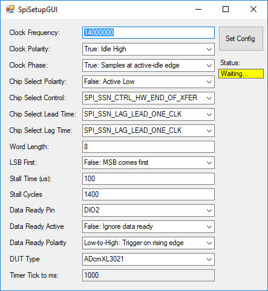
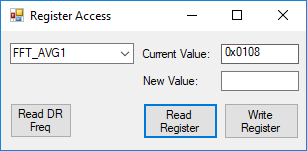
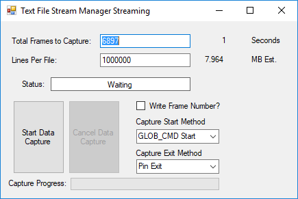

# iSensor ADcmXL FX3Gui Example 

## Overview

The iSensor FX3 firmware and interface provide you with a means of acquiring sensor data over a high-speed USB connection in any application that supports .NET libraries. This application shows how to implement both the firmware and the interface in a VB.NET environment. This application was designed around the FX3 SuperSpeed Explorer Kit and relies on the open source libraries provided by Cypress to operate. 

Using both the FX3 firmware and the FX3Interface libraries enables you to acquire sensor data quickly while this application gives you a starting point from which to build your custom solution.  

## Hardware Requirements

The firmware is designed to be built and run on a Cypress SuperSpeed Explorer Kit (CYUSB3KIT-003). A breakout board designed to convert the Explorer Kit's pins to a standard, 16-pin, 2mm connector used on most iSensor evaluation should be available soon. A schematic showing how to connect iSensor products to the Explorer Kit can be found in the Documentation folder of the iSensor FX3 firmware repository [here](https://github.com/juchong/iSensor-FX3-Firmware/tree/master/Documentation). 

The Explorer Kit requires two jumpers to be installed before the interface library will communicate. The image below shows where the jumpers must be installed.

 

## Getting Started

The Explorer Kit must be programmed every time that it is powered off/on since the firmware is loaded into RAM by default. Clicking the "Connect to FX3" button in the main GUI will attempt to push firmware into the FX3 Explorer board, communicate with both the FX3 Explorer board and the sensor, and verify that the sensor has been properly connected by writing a random value to one of the user scratch registers and attempting to read it back. If successful, all buttons in the GUI will be enabled, allowing you to exercise additional features built into the interface and firmware. 

## SPI Configuration

The FX3 offers the flexibility to configure SPI parameters on-the-fly. We've implemented a simple GUI to make adjustments to the SPI configuration easy. The SPI configuration window includes many settings specific to the FX3, so please refer to the firmware library documentation for additional details. By default, the FX3 will be configured with settings that should work with product in the ADcmXL family. Note that a few features pertain only to IMUs and may be irrelevant for ADcmXL applications.

## Register Access and Manual Data Capture

The register access window allows you to read and write single registers as you would in any embedded application. The register locations, default values, and properties are loaded from the `adcmxl3021_regmap_adisAPI.csv` file located in the root directory of the project. In order to capture FFT or Time Capture data, the manual data capture window allows for different types of captures to be quickly performed and saved to a .csv file on your PC. 

## Real-Time Streaming

The FX3Gui application offers two methods of capturing real-time data. The `Real Time Streaming` form is very rudimentary and captures data by acquiring it from the FX3Interface class and appending it to a list. This list is then saved to disk at the end of the capture. The `Text File Stream Manager Streaming` form implements a `Text File Stream Manager` class which handles acquiring, buffering, and saving data to disk using background workers. This method of data capture is highly recommended. 

## FX3-Related Utilities

Additional functions such as resetting the FX3, resetting the DUT (using the hardware reset pin), reading a pin value, reading the FX3 firmware ID, and checking the DUT connection are all available for use in your application. 

# Additional Repositories

Two additional repositories are required for this example to operate. The FX3Interface where all FX3-related functions are implemented and the FX3 firmware are both essential for managing the USB -> SPI bridge the FX3 offers, and should serve as a good starting point for your application.

1. [FX3 Firmware](https://github.com/juchong/iSensor-FX3-Firmware)

2. [FX3Interface](https://github.com/juchong/iSensor-FX3-Interface)
