# iSensor FX3 Example GUI (ADcmXL/IMU)

## Overview

The iSensor FX3 firmware and API provide you with a means of acquiring sensor data over a high-speed USB connection in any application that supports .NET libraries. This application shows how to implement both the firmware and the interface in a VB.NET environment. This application was designed around the FX3 SuperSpeed Explorer Kit and relies on the open source libraries provided by Cypress to operate. 

Using both the FX3 firmware and the FX3API libraries enables you to acquire sensor data quickly while this application gives you a starting point from which to build your custom solution.  

## Hardware Requirements

The firmware is designed to be built and run on a Cypress SuperSpeed Explorer Kit (CYUSB3KIT-003). A breakout board designed to convert the Explorer Kit's pins to a standard, 16-pin, 2mm connector used on most iSensor evaluation should be available soon. A schematic showing how to connect iSensor products to the Explorer Kit can be found in the Documentation folder of the iSensor FX3 firmware repository [here](https://github.com/juchong/iSensor-FX3-Firmware/tree/master/Documentation). 

The Explorer Kit requires two jumpers to be installed before the interface library will communicate. The image below shows where the jumpers must be installed. The other two jumpers must be left open.

 

## Getting Started

Ensure that you have the [Analog Devices FX3 driver](https://github.com/juchong/iSensor-FX3-API/raw/master/drivers/FX3DriverSetup.exe) installed.

Ensure that the FX3 board is plugged into a USB 2.0 or better port on your PC and that the FX3 jumpers are correctly placed as described in the Hardware Requirements.

Open the FX3 GUI and wait for a new "Analog Devices iSensor FX3 Bootloader" device be detected by windows. This may take a few seconds, since the bootloader image must be loaded onto the FX3 flash memory.

## Connecting to an FX3

The iSensors FX3 Demonstration Platform supports connecting to multiple FX3 boards concurrently. When you first load the Example GUI and click the connect button, an FX3 selection GUI will load. This GUI provides a drop down to select the FX3 board to connect to by serial number. The board currently selected on the dropdown will blink an LED. If there is only a single FX3 board connected to your PC, that board will be selected to connect to.

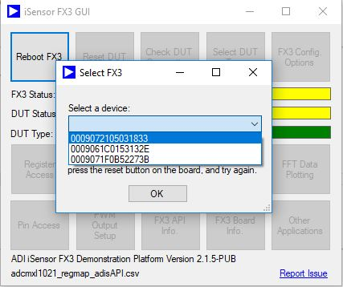

After the desired FX3 board is selected, The iSensors FX3 Demonstration Platform must be loaded into RAM. Clicking the "Connect to FX3" button in the main GUI will attempt to push firmware into the FX3 Explorer board, communicate with both the FX3 Explorer board and the sensor, and verify that the sensor has been properly connected by writing a random value to one of the user scratch registers and attempting to read it back. If successful, all buttons in the GUI will be enabled, allowing you to exercise additional features built into the interface and firmware. 

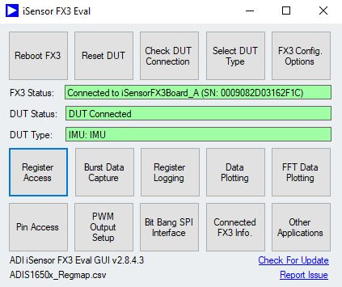

## FX3 and SPI Configuration

The FX3 offers the flexibility to configure SPI and other board parameters on-the-fly. We've implemented a simple GUI to make adjustments to the SPI configuration easy. The SPI configuration window includes many settings specific to the FX3, so please refer to the firmware library documentation for additional details. By default, the FX3 will be configured with settings that should work with the selected device type.

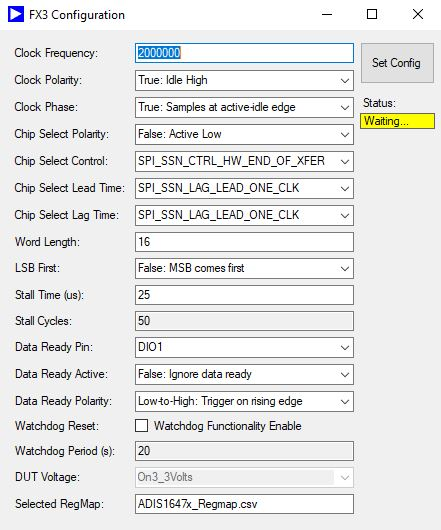

## DUT Selection

The FX3 Example GUI provides a form to select the DUT and Sensor type connected (ADcmXL, IMU, etc). This setting is persistent though instances of the form.

## Register Access

The register access window allows you to read and write registers as you would in any embedded application. The register locations, default values, and properties are loaded from the register map file selected when the program loads.

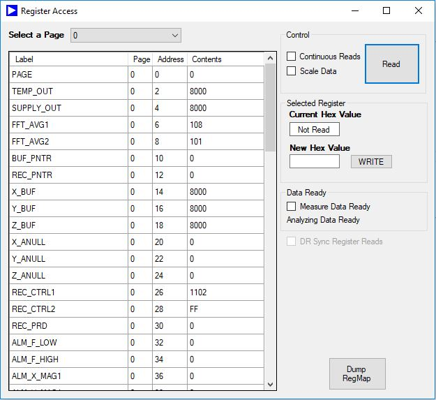

## Real-Time Streaming

The FX3 Example GUI provides a form to stream real time data from the ADcmXL series of parts. All frame data is logged to a .csv file. This form supports multiple "samples" triggered by a timer or an external pin on the FX3.

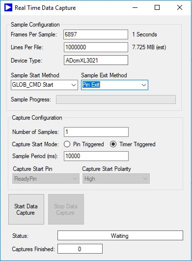

## IMU Burst Streaming

The FX3 Example GUI provides a form to stream burst data from IMU products. All data is logged to a .csv file.

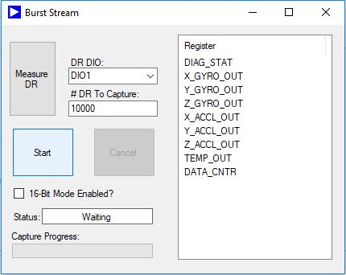

## Data Plotting

The FX3 Example GUI provides a form to stream data from a DUT and plot it in real time. The plot scale and time can be adjusted using the form controls. Plot data can be logged to a CSV file and played back at any time.

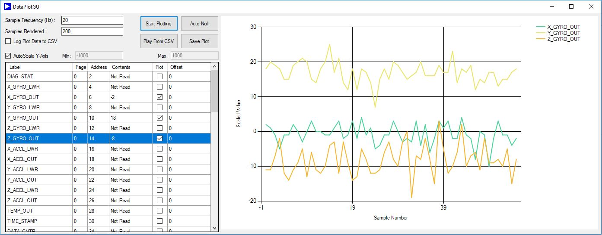

## FFT Data Plotting

The FX3 Example GUI provides a form to stream data from a DUT and plot the spectral results in real time. The plot scale, fft size, and FFT averages can be adjusted using the form controls. Clicking on the plot window places a data marker. Plot data can be logged to a CSV file.

# PWM Setup and Pin Access

The FX3 Example GUI provides a form to read or set pin values.

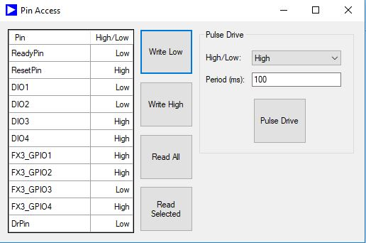

The FX3 can also drive a PWM signal onto any of the output pins. The PWM setup GUI allows you to configure the PWM frequency and duty cycle as needed for each pin.

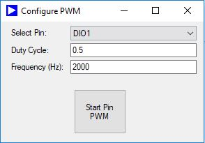

# FX3 API Information

The FX3 Example GUI allows you to load information about the current version of the FX3 API being used. This includes a link to the source code commit on GitHub.

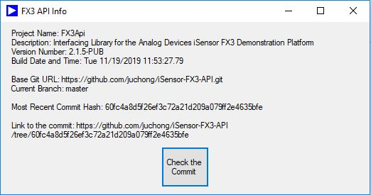

The FX3 Example GUI allows you to load information about the currently connected FX3 board.

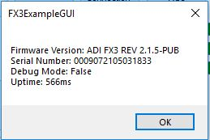

## FX3-Related Utilities

Additional functions such as resetting the FX3, resetting the DUT (using the hardware reset pin), reading a pin value, reading the FX3 firmware ID, and checking the DUT connection are all available for use in your application. 

# Troubleshooting

# Issues installing FX3 Driver

If you encounter issues installing the FX3 driver, try running the installer as elevated or admin.

# Issues with connecting to FX3

If you cannot connect to the FX3 initially (first time setup), check that the Analog Devices FX3 bootloader is properly loaded onto flash. By default, the Cypress SuperSpeed Explorer Kit ships with an image on flash which does not include bootloader capabilities. If the Analog Devices FX3 Bootloader is not loaded, set jumper J4 to disable flash boot, open the FX3 Example GUI, wait approximately 5 seconds for the bootloader to load onto flash, remove the jumper, and reset the FX3. The Bootloader should now properly be loaded onto flash memory.

If you cannot connect to the FX3 after performing first time setup, try pressing the reset button on the FX3. If the FX3 is performing an operation with a long timeout, it may be unresponsive to USB commands, depending on the operation type.

# Additional Repositories

Two additional repositories are required for this example to operate. The FX3 API, where all FX3-related functions are implemented, and the FX3 firmware are both essential for managing the USB -> SPI bridge the FX3 offers, and should serve as a good starting point for your application.

1. [FX3 Firmware](https://github.com/juchong/iSensor-FX3-Firmware)

2. [FX3API](https://github.com/juchong/iSensor-FX3-API)
