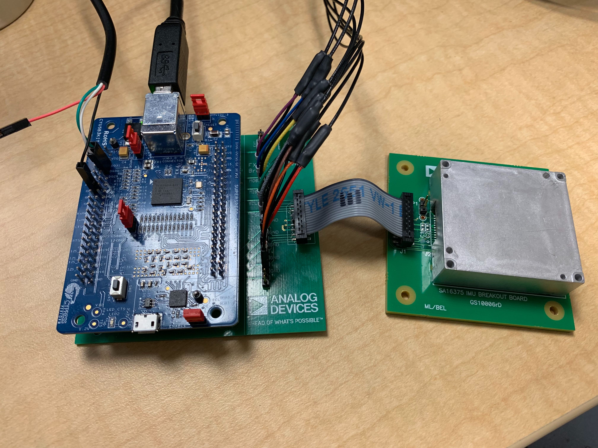
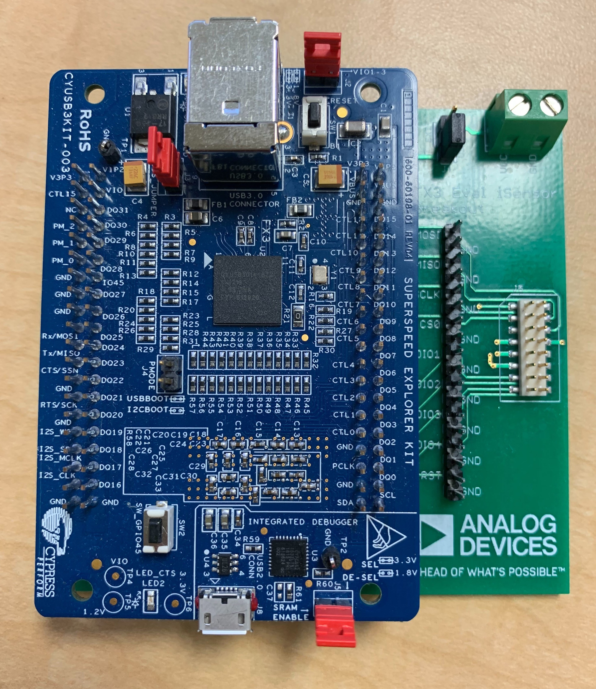
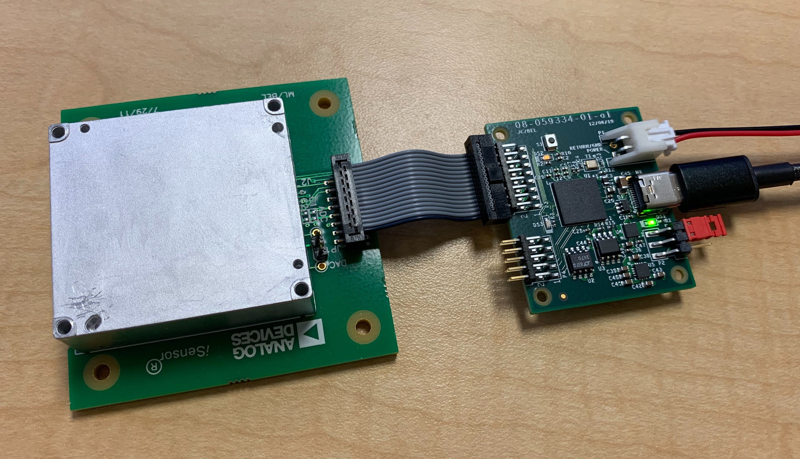

# iSensor FX3 Evaluation Hardware

## Overview

The FX3 firmware was initially developed using a Cypress EZ-USB FX3 SuperSpeed Explorer Development Kit and targeted the CYUSB3014/CYUSB2014 family of USB interface ICs offered by Cypress Semiconductor.

## SuperSpeed Explorer Development Kit Breakout Board

A breakout board designed for interfacing iSensor devices with the Cypress SuperSpeed Explorer Kit ([CYUSB3KIT-003](https://www.cypress.com/documentation/development-kitsboards/cyusb3kit-003-ez-usb-fx3-superspeed-explorer-kit)) was introduced as a temporary solution to aid software development. The breakout board design was very simple and only included a 16-pin,2mm connector and a header for probing the digital communication signals. 

The breakout board design files can be found in the hardware folder of this repository ([link](Cypress FX3 Explorer Eval Breakout Board)).

## SuperSpeed Explorer Kit Jumper Configuration

**Three** jumpers **must** be installed on the SuperSpeed Explorer Kit as shown below to operate correctly. **Jumpers J2, J3, and J5 must be installed** when using the SuperSpeed Explorer Kit. **Jumper J4 must be open** to allow booting from the onboard EEPROM. 

 

## EVAL-ADIS-FX3

Once the project's hardware requirements matured, the [EVAL-ADIS-FX3](https://www.analog.com/en/design-center/evaluation-hardware-and-software/evaluation-boards-kits/eval-adis-fx3.html) was developed. This design reduced the size and cost of the original development platform while adding additional features tailored for IMU applications. 

The EVAL-ADIS-FX3 features include:

- A dedicated, onboard 3.3V, 2A linear regulator designed for high-transient applications
- A USB-C connector (USB 2.0 compatible only)
- An onboard, field-upgradable EEPROM with USB bootloader fallback
- A software-selectable OFF / 3.3V / 5V IMU supply output with overcurrent and short protection
- A JST-XH-2 external supply connector
- Selectable USB and external supply selection
- Onboard status LEDs for each IMU GPIO pin
- An iSensor standard, 16-pin, 2mm connector for compatibility with existing iSensor breakout boards and adapters
- An additional 10-pin, 2mm connector for feature expansion. As of writing, the firmware and API include support for:
- FX3 UART debugging
- Four additional GPIO pins for external test equipment triggering and sensing (separate from the IMU GPIOs)
- Separate 3.3V and 5V supplies from the DUT supply meant to power external level shifters, drivers, interface ICs, etc.
- An extra, “bit-banged” SPI port to allow for “non-standard” SPI configurations and communication with external hardware (ADCs, DACs, protocol interface ICs, etc.)
- An I2C port meant for interfacing with I2C-compatible inertial sensors
- Concurrent, multi-board data capture capability. Multiple EVAL-ADIS-FX3 boards can be connected to the same PC and can concurrently capture data independently of each other
- Very low CPU usage while capturing data, even on older Windows machines
- Windows 7, 8, and 10 compatibility
- 1.5“ x 1.75” PCB footprint

The EVAL-ADIS-FX3 design files can be found in the hardware folder of this repository ([link](EVAL-ADIS-FX3_RevC)).
