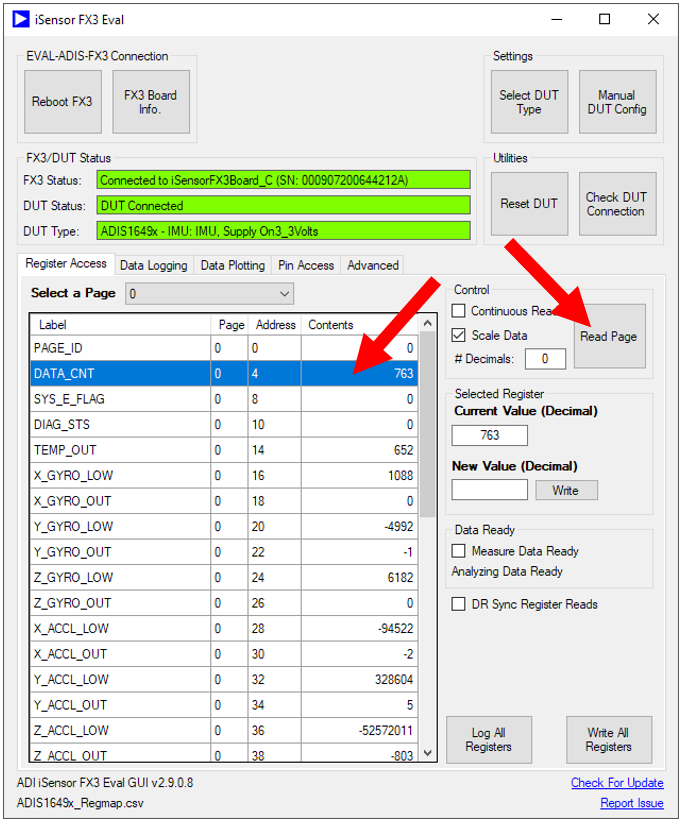

# Welcome to the iSensor-FX3-Eval IMU evaluation GUI for the EVAL-ADIS-FX3! 
The EVAL-ADIS-FX3 is the latest addition to the iSensor evaluation portfolio and was designed from the ground up to provide users with an easy-to-use solution for capturing reliable inertial data in lab and characterization environments. To stop showing this guide, check the "Do Not Show Again" box at the bottom of this form.

## Driver Installation
If this is your first time using the EVAL-ADIS-FX3 on this PC, you must install the Analog Devices FX3 drivers. It is recommended to install these drivers as elevated or administrator. The driver installer can be downloaded from the EVAL-ADIS-FX3 evaluation board page: https://www.analog.com/en/design-center/evaluation-hardware-and-software/evaluation-boards-kits/eval-adis-fx3.html#eb-relatedsoftware

## FX3 Board Setup
To use the iSensor FX3 Eval GUI, an EVAL-ADIS-FX3 board must be connected to your PC USB port via the USB C connector. USB 2.0 or USB 3.0 should be used for best device operation.

## Checking USB Connection
Once the EVAL-ADIS-FX3 drivers are installed, and the device is connected, the FX3 board should enumerate as an "Analog Devices iSensor FX3 Bootloader" in the Windows device manager. If this is not successful, see the Wiki page linked at the bottom of this guide for more detailed troubleshooting information.

## DUT Hardware Connection
All Analog Devices IMU products can be connected to the 16-pin header on the EVAL-ADIS-FX3, when paired with the appropriate sensor coupon or breakout board. To find the coupon board for your device, see the Analog Devices product page for that device. For general EVAL-ADIS-FX3 <-> IMU connection troubleshooting tips, see the Wiki page linked at the bottom of this guide.

## Selecting DUT Personality
The software will ask you to select a device configuration to load. From the first drop down menu, select the product family of the sensor you're connecting to. From the second drop down menu, select the specific device (e.g. ADIS1650x -> ADIS16505-2), then click on “Apply Device Settings.” To change the setting, use the "Select DUT Type" button in the iSensor FX3 Eval GUI main page.

## Connecting to the EVAL-ADIS-FX3 board
To connect to the EVAL-ADIS-FX3 board, click the "Connect" button. If you have several FX3 boards connected to the same PC, another dialog box asking you to select a target FX3 board should pop up. Click on the drop-down menu and select each of the unique serial numbers until you identify the board you’re trying to talk to. The “activity” LED on the target board should blink. Once you’ve made a selection, click OK.

## Viewing EVAL-ADIS-FX3 Information
Once you have connected to the EVAL-ADIS-FX3 board, click the "FX3 Board Info" button to view information on the connected board. This includes the software revision (firmware and .NET API), board hardware revision, and uptime.

## Checking Connection to DUT
By default, when the iSensor FX3 Eval software first connects to the EVAL-ADIS-FX3 board, it checks the SPI communications to the DUT by performing a sequence of IMU register write and read back operations. The result of this operation is placed in the "DUT Status" box. The connection can be checked on demand using the "Check DUT Connection" button. The image below shows the message when the register write / read back process fails (typically indicating there is a connection problem)

## Reading DUT Register Data
The “Register Access” tab provides a quick way to modify IMU registers, allowing for manual configuration of the IMU without the need to develop any extra software. Hex-to-decimal conversion can be toggled by checking the “Scale Data” check box in the upper-right corner of the screen. The “Continuous Read” check box will toggle an automatic, periodic read of all the registers listed on the current page. Individual registers can be read by clicking on the corresponding register’s cell in the table. The entire page may also be read by clicking the “Read Page” button in the upper-right corner of the screen.

## Writing DUT Register Data
Registers can be written in either hexadecimal or decimal format by selecting the target register, typing the new value in the “New Value” text box, and clicking on “Write.”

## Logging DUT Register Data
The “Register Logging” tab provides a means of continuously streaming IMU registers to the PC and recording them in .csv format. The register list is entirely customizable and can be saved in a file for future use. Register reads can either be synchronized to each data ready strobe (DR Active box checked) or read asynchronously.

## Logging DUT Burst Read Data
The "Burst Data Capture" button provides an application which allows streaming of IMU burst data to a .csv file. This application will configure the DUT burst response based on the capabilites of the connected IMU (for example, 16-bit vs 32-bit output channel data).

## Plotting DUT Data (Time Domain)
The “Data Plotting” form allows you to quickly visualize sensor data and optionally record it to a file. A recorded plot log can then be played back using the same form. Several registers can be plotted concurrently. The plot line colors can be set (hex format) by editing UserConfig/plot_colors.txt included with the application. An arbitrary number of plot windows can be shown concurrently, using the add and remove plot options.

## Plotting DUT Data (Frequency Domain)
The “FFT Data Plotting” form allows you to visualize the FFT sensor outputs in near-real-time. Markers and -3dB point lines can also be added to the plots to aid in evaluating the frequency response of our high-performance IMUs. The plot line colors can be set (hex format) by editing UserConfig/plot_colors.txt included with the application

## GPIO Interfacing
The "Pin Access" tab of the GUI can be used to read the state of all DIO pins, drive each pin high or low, generate a PWM signal, generate a single fixed duration pulse, or measure a pin toggle frequency. Be cautious - driving an IMU output pin with the EVAL-ADIS-FX3 can cause permanent damage!

## Advanced DUT Configuration
The FX3 SPI parameters, loaded register map, supply voltage, and selected DUT family settings can be changed under the "Manual DUT Config" window. Changing any of these settings will result in a "Custom" DUT type being loaded. The custom SPI settings picked will be persistent until a new DUT personality is selected, or the setting is manually changed again. Any changes to the SPI settings can be reverted to a known good configuration using the "Select DUT Type" GUI.

## Configuring GUI Appearance
The GUI color scheme can be customized to meet your preferences. Under "Manual DUT Config" -> "Edit Colors" each color used by the iSensor FX3 Eval software can be configured. The background color, success color, error color, and idle color for all forms can be set. These settings will be persistent through instances of the application.

Please feel free to post any suggestions for enhancements, bug reports, or general feedback on the Analog Devices GitHub issues page for this project. This can be accessed by clicking the "Report Issue" link at the bottom of the application.