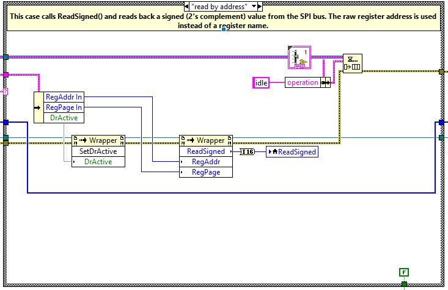
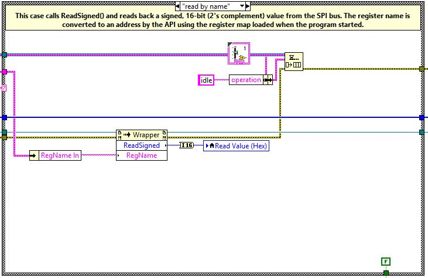
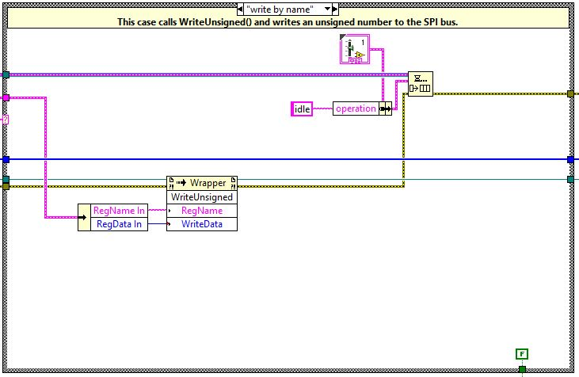
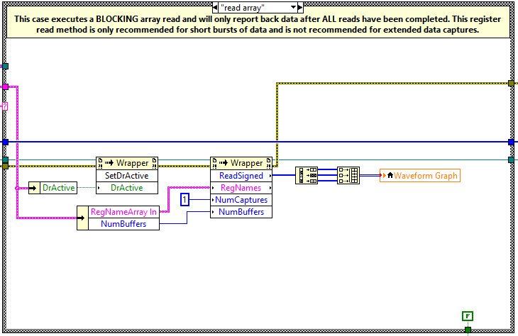
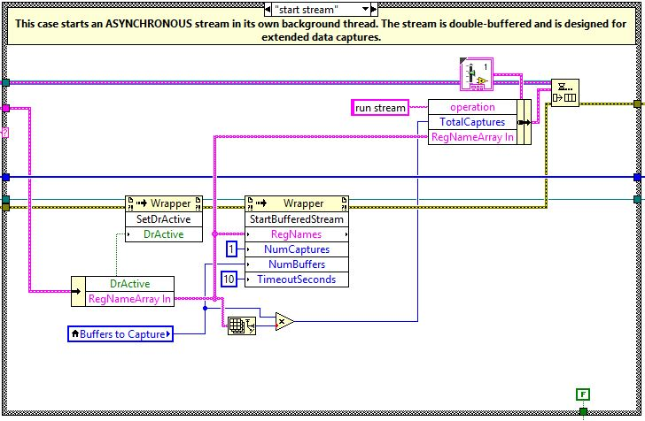
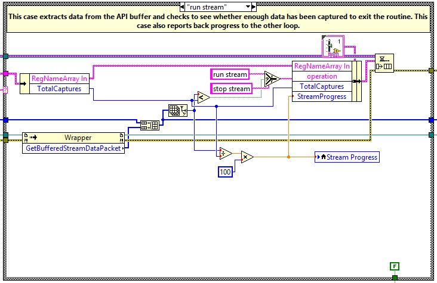
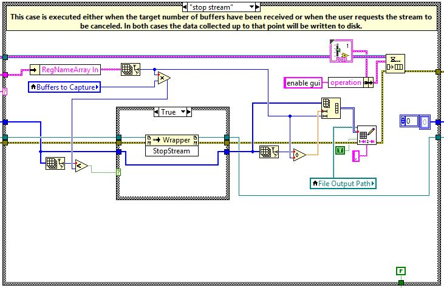
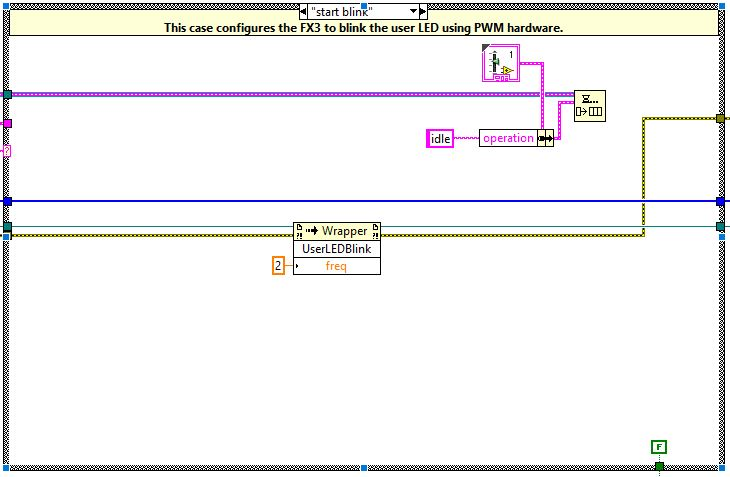

# LabVIEW Example Overview

The LabVIEW example provides a boilerplate project that demonstrates some of the basic data capture features available through the FX3Api and hardware. This example was not designed to be as in-depth as the FX3 Evaluation GUI, but should provide a good starting point for developing a command queue-based program. 

## Example Modules

The LabVIEW example includes several command queue cases that can easily be copy-pasted into existing code. The included Control provides a means of passing data to the processing loop using the command queue structure. 

### Raw Register Read Example

At its core, the FX3Api simplifies reading and writing data to the SPI bus. This example is designed to show the most basic functionality of reading specific register locations without using the register map or other advanced features. 

This example calls ReadSigned() and reads back a signed integer value from the SPI bus. The raw register address is sent to the IMU in the first transaction and the response is read back in a subsequent transaction. 

### Read/Write Register By Name Example

The FX3Api offers several calls for reading and writing registers over SPI. This implementation utilizes the register map parsed at the start of the example to look up the register location. This gives simplifies the interface by allowing users to work with register names instead of register addresses. The API manages the parsing and conversion processes in the background.

These examples use ReadSigned() and WriteUnsigned() respectively calls to read and write data from the SPI bus. 

### Array Read Example

Array reads are useful when several registers need to be read from the SPI bus because the FX3Api strings together the sequence of read to better saturate the half-duplex communication protocol. This example **BLOCKS** execution, so it should **not** be used in code where responsiveness is desired (such as in a GUI). This method of reading data is only recommended for single (non-looping) reads since performance will heavily rely on the loop execution time of the program.

This method of reading data is **not recommended** for very long data captures. 

### Asynchronous Streaming Example

An asynchronous stream (Buffered Stream) is the preferred method of capturing data for extended periods of time when using the FX3 platform. The double-buffer architecture hidden "under the hood" provide users with a very stable means of acquiring sensor data. The StartBufferedStream() call kicks off a dedicated processing thread that manages the process dequeuing data from the USB buffer and presenting it to the user via GetBufferStreamDataPacket(). This processing thread also provides hooks allowing the data progress to be monitored and giving users the ability to asynchronously cancel the stream. 

This stream strategy has been tested on dozens of PC hardware configurations and months of consecutive data capture tests and has consistently proven to provide reliable, lossless data captures. 

###  LED Blinking Example

This example demonstrates some of the PWM capabilities available on the EVAL-ADIS-FX3. The LED blink function leverages an onboard hardware PWM function made available through the FX3Api. 

## Additional Resources

### FX3Api Documentation

The FX3Api documentation contains more detailed descriptions of the functions implemented by this example. The most up-to-date documentation can be found [here](https://analogdevicesinc.github.io/iSensor-FX3-API/).

### EVAL-ADIS-FX3 Wiki

The wiki located [here](https://wiki.analog.com/resources/eval/user-guides/inertial-mems/evaluation-systems/eval-adis-fx3) describes the EVAL-ADIS-FX3 hardware and software in more detail and provides links to additional hardware and software resources.